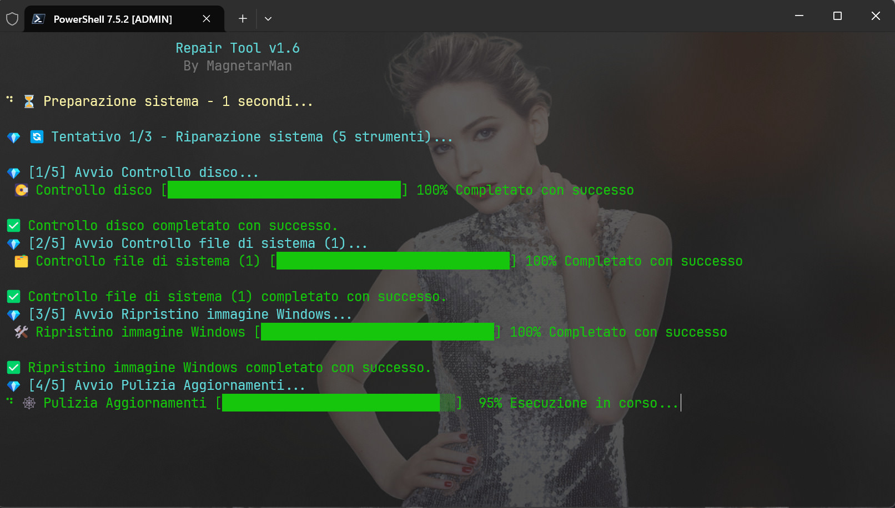

<p align="center">
	
	<h1>WinToolkit: la soluzione definitiva per <em>sopravvivere</em> con Windows</h1>
</p>
<p>
	
	
	
	
	
</p>


WinToolkit è una suite di script PowerShell potente e compatta, progettata per offrire a professionisti IT, amministratori di sistema e utenti esperti un controllo granulare sulla manutenzione e sulla risoluzione dei problemi di Windows e della Suite Office. Questo toolkit intuitivo aggrega gli strumenti di riparazione di sistema più efficaci in un'unica interfaccia, automatizzando i processi complessi per ottimizzare le prestazioni e ripristinare la stabilità del sistema con pochi passaggi automatizzati. Questo progetto è traslitterato tramite un workflow AI.

---

## ⚙️ Requisiti minimi

> [!IMPORTANT]
> Prima di avviare il toolkit, assicurati di soddisfare i seguenti requisiti:
>
> - **connessione ad Internet**;
> - **spazio libero su disco**: >= 50 GB [(vedere la sezione F.A.Q.)](#-faq---domande-frequenti);
> - **Windows >= 8.1**.

| Versioni di Windows          | Supportato             |
|:---|:---|
| Windows 11 >= 22H2           | 🟢 Sì                  |
| Windows 11 <= 21H2           | 🟡 Sì con eccezioni    |
| Windows 10 >= 1809           | 🟢 Sì                  |
| Windows 10 <= 1809           | 🟠 Parzialmente        |
| Windows 8.1                  | 🟠 Parzialmente        |
| Windows 8 e inferiori        | 🔴 No                  |

##  🚀 Come eseguire WinToolkit

Installa l'eseguibile di WinToolkit sul desktop seguendo queste istruzioni:

1. Premi il tasto `Windows` sulla tastiera oppure clicca sulla ricerca di Windows.
2. Digita `Powershell` nel campo della ricerca.
3. Clicca col tasto destro del mouse sulla voce `Powershell`.
4. Clicca sulla voce `Esegui come amministratore` dal menù a tendina.
5. Copia e incolla nella finestra di Powershell il comando seguente:

```powershell
irm https://magnetarman.com/winstart | iex
```

6. Al riavvio del tuo PC troverai la scorciatoia `Win Toolkit` sul desktop da cui avviare comodamente lo script in modalità amministratore con un semplice doppio click sull'icona.

### ⚙️ Per utenti esperti

> [!WARNING]
> Se stai avviando WinToolkit da versioni parzialmente supportate è consigliabile utilizzare PowerShell 7 o versioni successive. Questa versione moderna è necessaria per garantire la massima compatibilità, eseguire correttamente le operazioni del tool e prevenire errori di runtime o l'errata applicazione delle modifiche.

1. Installa Powershell 7 (o versioni successive) da [Microsoft Store](https://www.microsoft.com/store/apps/9MZ1SNWT0N5D) oppure da [GitHub](https://learn.microsoft.com/it-it/powershell/scripting/install/install-powershell-on-windows?view=powershell-7.5#msi).
3. Premi il tasto `Windows` sulla tastiera oppure clicca sulla ricerca di Windows.
4. Digita `Powershell` nel campo della ricerca.
5. Clicca col tasto destro del mouse sulla voce `Powershell`.
6. Clicca sulla voce `Esegui come amministratore` dal menù a tendina.
7. Copia e incolla nella finestra di Powershell il comando seguente:

```powershell
irm https://magnetarman.com/WinToolkit | iex
```

### 👨‍💻 Per i beta-tester

> [!CAUTION]
> Avviare le versioni in fase di sviluppo è **rischioso e potrebbe causare danni al tuo sistema.** Sono presenti funzionalità in corso di sviluppo e/o in fase di test. Se non sei sicuro o non sai cosa stai facendo, vai alla sezione "Esecuzione consigliata".

```powershell
irm https://magnetarman.com/WinToolkit-Dev | iex
```

---

## 👾 Componenti
- **Windows Repair Toolkit**: Avvia una sequenza automatizzata di comandi standard di Windows, come: sfc, chkdsk e DISM per individuare e correggere la corruzione dei file di sistema e i problemi del disco.
- **Windows Update Reset**: Risolve in modo efficiente i problemi comuni di Windows Update resettando i componenti chiave e ripristinando le impostazioni dei servizi.
- **Office Toolkit**: Semplifica l'installazione, la riparazione e la rimozione dei componenti o del prodotto intero. È possibile installare una versione "Basic" di Microsoft Office in modo semi-automatico, riparare le installazioni esistenti con due diverse modalità (Riparazione rapida offline e riparazione completa online), oppure rimuovere completamente il software dal sistema utilizzando l'efficace strumento ufficiale "Microsoft Support and Recovery Assistant (SaRA)".
- **Windows Store Repair**: Esegue una reinstallazione di componenti critici come: Microsoft Store, WinGet, e UniGet UI (Utile per aggiornare e gestire le app in modo grafico utilizzando WinGet).
- **Win Backup Driver**: Semplifica il processo di backup dei driver, che automatizza l'esportazione di tutti i driver di terze parti installati utilizzando il comando DISM per garantire un'operazione completa e affidabile.
- **Cleaner Toolkit**: Libera spazio su disco e ottimizzare le prestazioni eseguendo una pulizia profonda.
- **Video Driver Install**: Semplifica l'installazione, l'aggiornamento, la reinstallazione e la configurazione ottimale dei driver video (GPU) per sistemi NVIDIA e AMD, gestendo anche la pulizia precedente e bloccando gli aggiornamenti automatici dei driver da Windows Update, spesso fonte di instabilità.

> [!Note]
>
> Esegui lo script. Al riavvio del computer, il sistema entrerà automaticamente in **Modalità Provvisoria**.
>
> Una volta terminate le tue operazioni, come la pulizia dei driver obsoleti tramite DDU, troverai un file chiamato "Switch To Normal Mode.bat" sul tuo Desktop. Per tornare alla modalità di avvio standard di Windows, fai doppio click su questo file e poi riavvia normalmente il computer.

- **Gaming Toolkit**: Progettato per ottimizzare rapidamente il tuo PC Windows per le massime prestazioni di gioco. Si occupa di installare tutti i componenti essenziali (come DirectX, .NET e Visual C++ redistributables), installa i client di gioco più comuni (Steam, Epic, GOG, ecc.), attiva il profilo energetico 'Performance Massime' e disattiva le interruzioni con la modalità "Non disturbare". Essenzialmente, prepara il tuo sistema per giocare senza distrazioni e con la massima potenza.

> [!Note]
>
> In Windows 11 22H2 o inferiori, WinToolkit consiglierà di effettuare prima la funzione di riparazione di WinGet.

- **BitLocker Toolkit**: Avvia un processo automatizzato per disattivare la crittografia BitLocker sul drive di sistema (C:). Lo strumento verifica lo stato attuale e, se attivo, esegue il comando per avviare la decrittografia del volume in modo controllato. Infine aggiunge al registro di sistema una voce per cercare di contrastare future e possibili ri-attivazione occulte da parte di Microsoft.

---

## 🪟 Coming soon: GUI - Interfaccia grafica

> [!CAUTION]
> L'interfaccia grafica mostrata di seguito è un'anteprima, pertanto potrà subire modifiche anche significative. La sua condivisione risponde al forte interesse degli utenti verso una futura implementazione.


---

## 📌 Changelog

- [Leggi le modifiche introdotte.](/CHANGELOG.md)
- [Leggi la lista delle funzionalità in sviluppo.](/TODO.md)

---

## 💀 Dove tutto è iniziato (ver. 1.0)

<div align="center">

|                                                              |                                                                                   |
| :----------------------------------------------------------: | :-------------------------------------------------------------------------------: |
|  |  |

</div>

---

## 🤔 F.A.Q. - Domande Frequenti

### Perché usare WinToolkit?

Sia che tu stia gestendo un parco macchine aziendale o che tu voglia semplicemente mantenere il tuo PC personale in perfette condizioni, WinToolkit ti permette di:

- **risparmiare tempo**: automatizza ore di lavoro manuale di diagnostica e riparazione.
- **prevenire malfunzionamenti**: esegui manutenzioni preventive per evitare problemi futuri.
- **agire da esperto**: sfrutta la potenza degli strumenti ufficiali Microsoft di sistema con un'interfaccia semplice e sicura.

### Perché servono almeno 50 GB di spazio libero sul disco?

I 50 GB non servono allo strumento che pesa pochi KB, né ai download, ma solo a Windows per mantenere stabilità e funzionare correttamente durante le riparazioni.

Quando il sistema operativo lavora su componenti critici, ha bisogno di spazio vitale per gestire diversi processi in background:

- File temporanei e backup interni: Windows crea e gestisce file temporanei, copie di backup interne e cache durante la manutenzione.
- Gestione del file di paging (memoria virtuale): Lo spazio è cruciale per il file di paging, che Windows utilizza come "sostituto" temporaneo della RAM quando la memoria fisica si esaurisce. Se questo spazio è insufficiente, si possono verificare gravi errori di sistema.
- Prevenzione di malfunzionamenti: Operare con poco spazio libero (tipicamente meno del 10–15% dello spazio totale) è una causa comune di rallentamenti e malfunzionamenti generici in Windows. Avere un margine così ampio previene questi problemi e assicura che il sistema non diventi instabile.

In sintesi, i 50 GB sono una misura cautelativa per fornire a Windows l'ambiente di lavoro ideale e completare le operazioni senza interruzioni o errori dovuti alla gestione inefficiente dello spazio su disco.

### Dov'è la cartella di lavoro di WinToolkit?

Il percorso della cartella di lavoro di WinToolkit è:

`%localappdata%\WinToolkit`

### Dove sono i file di log?

Il percorso dove si trovano i file di log di WinToolkit è:

`%localappdata%\WinToolkit\logs`

---

## 💖 Supporta il progetto WinToolkit!

Se WinToolkit ti è stato utile, considera di supportare attivamente il progetto attraverso una [donazione](#-fai-una-donazione), oppure puoi [contribuire](#-contribuisci).

### 👛 Fai una donazione

La tua donazione non è solo un ringraziamento, ma un investimento diretto nel futuro e nello sviluppo di questo strumento.

Per effettuare una donazione, clicca sul bottone PayPal qui sotto aggiungendo un riferimento a "WinToolkit" nel messaggio, così entrerai nella Hall of Fame dei Contributori.

[](https://paypal.me/MagnetarManit/10)

🚀 Sviluppo continuo: le donazioni mi permettono di dedicare più tempo e risorse per mantenere la versione attuale aggiornata e compatibile, e per implementare nuove e potenti funzionalità.

🏆 Entra nella Hall of Fame: ogni donatore verrà incluso in una nuova sezione dedicata all'interno della lista dei contributori come ringraziamento per il tuo prezioso supporto.

✨ Accesso esclusivo alla futura "GUI Edition" (coming soon): per coprire i costi e il tempo di sviluppo che impiego, la futura e attesissima versione con interfaccia grafica (GUI) sarà facilmente offerta in anteprima a chi avrà supportato il progetto con una donazione libera. La versione da terminale (attualmente disponibile) rimarrà comunque completamente gratuita per tutti.

### 🔰 Contribuisci

Se non puoi donare, puoi comunque aiutarmi a migliorare WinToolkit attraverso queste azioni:

⭐ **Metti una stella**: mettendo una stella al progetto lo farai diventare più popolare su GitHub.

🐛 **[Segnala un problema](https://github.com/Magnetarman/WinToolkit/issues)**: segnala un bug che hai trovato o richiedi nuove funzionalità.

💡 **[Invia Pull Request](https://github.com/Magnetarman/WinToolkit/pulls)**: invia la tua risoluzione di un bug o la tua aggiunta di una nuova funzionalità.

💬 **[Partecipa alle Discussioni](https://t.me/GlitchTalkGroup)**: condividi le tue idee, fornisci feedback o fai domande.

Grazie di cuore per il tuo supporto!

## 🌟 Lista dei Contributori

[Guarda la lista dei contributori.](/CONTRIBUTING.md)

---

## 🎉 Traguardi

- [x] 11/01/2026 - 10 Stelle raggiunte.

---

## 🎗 Autore

Creato con ❤️ da [Magnetarman](https://magnetarman.com/).
