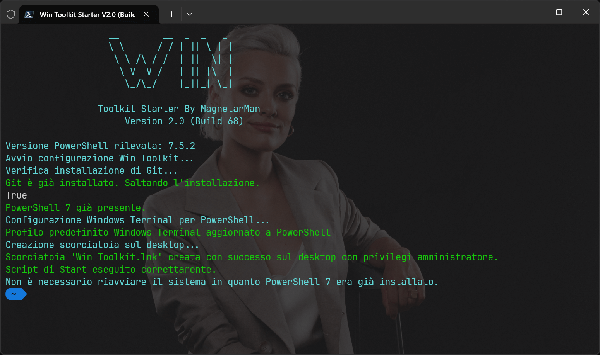
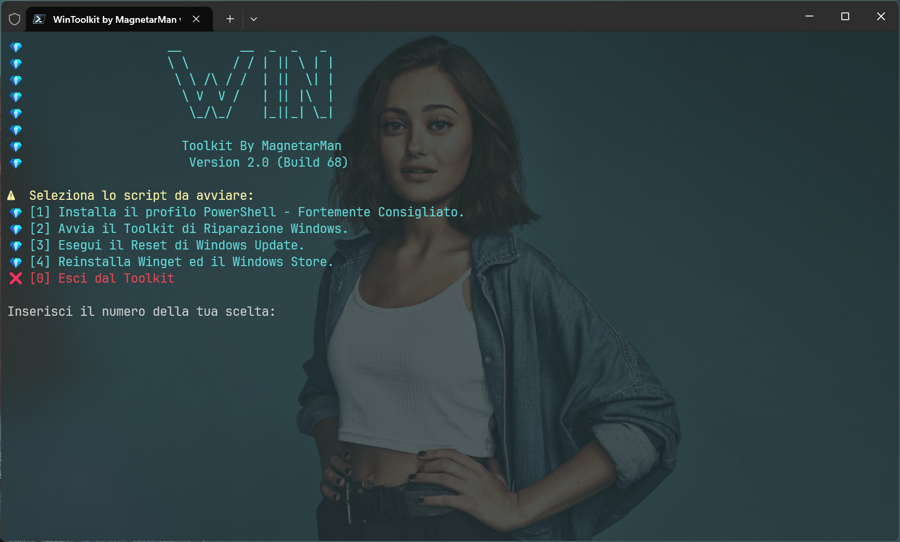
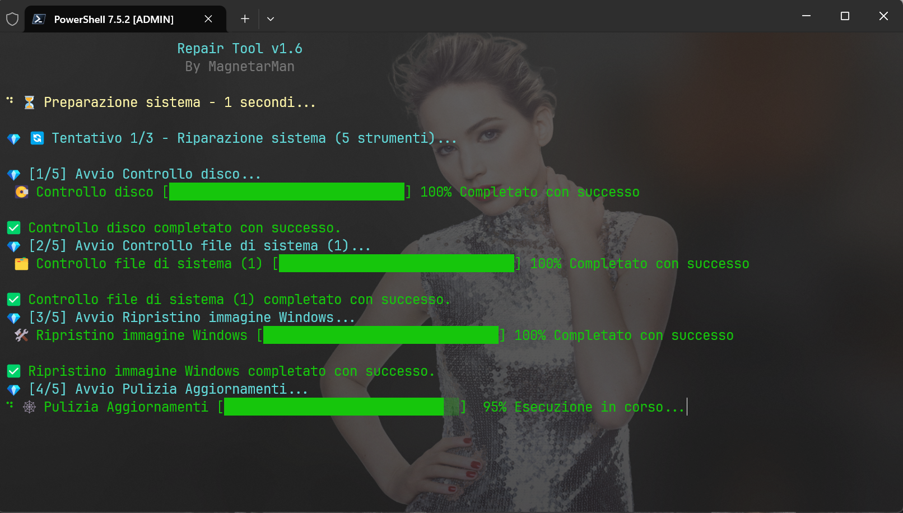
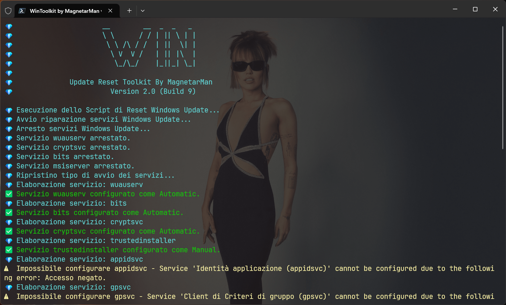

<p align="center">
	
</p>
<br>
<p align="center">
	<em><code>🛠️ WinToolkit: La Soluzione Definitiva per SOPRAVVIVERE A WINDOWS.</code></em>
    <br>
    <br>
    <code>WinToolkit è una suite di script PowerShell potente e compatta, progettata per offrire a professionisti IT, amministratori di sistema e utenti esperti un controllo granulare sulla manutenzione e sulla risoluzione dei problemi di Windows. Questo toolkit intuitivo aggrega gli strumenti di riparazione di sistema più efficaci in un'unica interfaccia, automatizzando i processi complessi per ottimizzare le prestazioni e ripristinare la stabilità del sistema con pochi clic.</code>
</p>
<br>

<p align="center">


</p>
<p align="center">
</p>
<br>

## 📸 ScreenShot

<div align="center">

|                                                                          |                                                                      |
| :----------------------------------------------------------------------: | :------------------------------------------------------------------: |
|              |                  |
|  |  |

</div>

---

## 👾 Features

> [!Note]
> La versione 2.0 è in **sviluppo attivo**.
>
> Il ramo **Experimental** ha codice in fase Beta _potrebbero essere presenti funzioni instabili_.
>
> Il ramo **Dev** ha codice e funzionalità in sviluppo attivo. **ATTENZIONE** - Utilizzare lo script presente nel ramo Dev potrebbe danneggiare il sistema.

- **Interfaccia Intuitiva**: Nonostante la sua potenza, il toolkit presenta un menu interattivo e facile da usare, che guida l'utente nella scelta dello strumento più adatto per il problema.
- **Aggiornamenti Automatici**: Il tool può verificare e installare automaticamente l'ultima versione di PowerShell, assicurando che tutti gli script funzionino con le funzionalità più recenti e in modo efficiente.
- **Riparazione del Sistema Completa**: Avvia una sequenza automatizzata di comandi standard di Windows come sfc, chkdsk e DISM per individuare e correggere la corruzione dei file di sistema e i problemi del disco. Il tool esegue più tentativi e genera un log dettagliato sul desktop, garantendo una tracciabilità completa delle operazioni.
- **Ripristino di Windows Update**: Risolve in modo efficiente i problemi comuni di Windows Update resettando i componenti chiave e ripristinando le impostazioni dei servizi. Questo script blocca e riavvia i servizi di aggiornamento, rinomina le directory di cache e ripara il registro di sistema, garantendo che il tuo sistema possa scaricare e installare gli aggiornamenti essenziali senza intoppi.
- **Log Dettagliati**: Tutte le operazioni sono registrate in un file di log salvato nel percorso `%localappdata%\WinToolkit\logs` (Inserisci il percorso senza apici dopo aver digitato `esegui` nel menu start di windows per accedere alla cartella dei log), fornendo un riassunto chiaro e professionale delle azioni eseguite, degli errori riscontrati e dei risultati finali.

### Perché usare WinToolkit?

Sia che tu stia gestendo un parco macchine aziendale o che tu voglia semplicemente mantenere il tuo PC personale in perfette condizioni, WinToolkit ti permette di:

- **Risparmiare Tempo**: Automatizza ore di lavoro manuale di diagnostica e riparazione.
- **Prevenire Malfunzionamenti**: Esegui manutenzioni preventive per evitare problemi futuri.
- **Agire da Esperto**: Sfrutta la potenza degli strumenti di sistema professionali con un'interfaccia semplice e sicura.

---

## 📁 Struttura Cartelle

```sh
└── WinToolkit/
    └── img
        ├── Banner.png
        ├── RepairToolkit.png
        ├── Run.png
        └── Starter.png
    ├── LICENSE
    ├── README.md
    ├── start.ps1
    └── WinToolkit.ps1
```

### 📂 Index Progetto

<details open>
	<summary><b><code>WinToolKit</code></b></summary>
		<blockquote>
			<table>
				<tr>
					<td><b><a href='https://github.com/Magnetarman/WinToolkit/blob/main/start.ps1'>start.ps1</a></b></td>
					<td><code>❯ Script di Start. Installa tutto il necessario automaticamente per far funzionare al meglio il ToolKit, Crea una scorciatoia sul Dekstop per avviare il Toolkit ed infine riavvia il PC per apportare le modifiche.</code></td>
				<tr>
					<td><b><a href='https://github.com/Magnetarman/WinToolkit/blob/main/WinToolkit.ps1'>WinToolkit.ps1</a></b></td>
					<td><code>❯ All'interno di questo script sono contenute tutte le funzioni ed il codice del tool.</code></td>
				</tr>
				</tr>
			</table>
		</blockquote>
</details>

---

## 🚀 Getting Started

### ☑️ Prerequisiti

Prima di avviare il tool, assicurati che il tuo ambiente di Runtime soddisfi i seguenti requisiti:

- **Windows Defender** di 24H2 potrebbe rilevare come pericoloso questo script. **E' fortemente consigliata la disattivazione temporanea durante le operazioni**
- **Richiesta Connessione ad internet durante l'esecuzione del Tool**
- Richiesto intervento manuale minimo.
- **Spazio su disco necessario**: 50GB Liberi (Windows durante le operazioni di riparazione occuperà temporaneamente dello spazio. L'indicazione di 50GB è sovrastimata ed utile per avere un certo margine di spazio libero ulteriore per il corretto funzionamento del Sistema)

### ⚙️ Installazione per Neofiti _Consigliata_

Avvia il Toolkit eseguendo il seguente metodo:

1. Avvia Powershell in modalità Amministratore ed inserisci il comando per avviare lo script di start:

```powershell
 irm https://raw.githubusercontent.com/Magnetarman/WinToolkit/main/start.ps1 | iex
```

2. Al riavvio del tuo PC troverai la scorciatoia `Win Toolkit V2.0` sul desktop da cui avviare comodamente lo script in modalità amministratore.

### ⚙️ Installazione Classica

Avvia il Toolkit eseguendo il seguente metodo:

1. Clona la repository WinToolkit:

```powershell
 git clone https://github.com/Magnetarman/WinToolkit
```

2. Utilizza il terminale per Navigare fino alla cartella:

```powershell
 cd WinToolkit
```

3. Lancia il Toolkit:

```powershell
 ./WinToolkit.ps1
```

---

## 📌 Project Roadmap

- [x] **`V1.0`**: <strike>Release Privata</strike>
- [x] **`V1.1.0`**: <strike>Refactor Struttura in forma modulare.</strike>
- [x] **`V2.0.0`**: <strike>**RELEASE Pubblica**. Refator totale progetto per future implementazioni.</strike>
- [x] **`V2.0.0 (Build 68)`**: <strike> Funzione **Repair Toolkit** Completa.</strike>
- [x] **`V2.0.0 (Build 71)`**: <strike> Funzione **Update Reset** Completa.</strike>
- [x] **`V2.0.0 (Build 72)`**: <strike> Readme Rework, Rework Grafico Script.</strike>
- [x] **`V2.0.0 (Build 73)`**: <strike> Start Script Potenziato, Fix Tool "WinUpdate Reset".</strike>
- [ ] **`VX.0.0`**: Finalizzazione "MagnetarMan Mode".

## 🕹️ TO DO

- [ ] Avvio script Chris con config personalizzata iwr -useb https://christitus.com/win | iex
- [ ] Aggiungere esecuzione di Tron Script ed esecuzione con intervento minimo
- [ ] Download ultima versione di DDU
  - [ ] Estrazione
  - [ ] Posizionamento nella cartella Downloads
  - [ ] Riavvio modalità provvisoria
- [ ] Installazione Driver Ottimizzato (Nvidia / AMD)
- [ ] Installazione Office Personalizzata tramite xml automatico (Versione Base con Solo Word, Excel, PowerPoint)
  - [ ] Riparazione Installazione Office corrotta e reinstallazione forzata
- [ ] Reinstallazione Installazione Store & Winget
- [ ] Reset Rust Desk
- [ ] Installazione e/o Aggiornamento Directx e librerie per il Gaming
  - [ ] Installazione client di gioco
  - [ ] Installazione Playnite ed applicazione Tema personalizzato
- [ ] Download immagine di Windows 23H2 Microwin
  - [ ] Posizionamento nella cartella download, pronta per essere utilizzata

---

## 🔰 Come Contribuire

- **💬 [Partecipa alle Discussioni](https://t.me/GlitchTalkGroup)**: Condividi le tue idee, fornisci feedback o fai domande.
- **🐛 [Segnala Problemi](https://github.com/Magnetarman/WinToolkit/issues)**: Segnala i bug trovati o richiedi nuove funzionalità per il progetto \Python-Script`.
- **💡 [ Invia Pull Request](https://github.com/Magnetarman/WinToolkit/issues)**: Revisiona le Pull Request (PR) aperte e invia le tue.

<details closed>
<summary>Linee Guida</summary>

1. **Esegui il Fork della Repository**: Inizia facendo il "fork" della repository del progetto sul tuo account GitHub.
2. **Clona in Locale**: Clona la repository di cui hai fatto il fork sulla tua macchina locale usando un client Git.

```powershell
   git clone https://github.com/Magnetarman/WinToolkit
```

3. **Crea un Nuovo Branch**: Lavora sempre su un nuovo "branch", dandogli un nome descrittivo.

```powershell
git checkout -b new-feature-x
```

4. **Apporta le Tue Modifiche**: Sviluppa e testa le tue modifiche in locale.
5. **Esegui il Commit delle Tue Modifiche**: Fai il "commit" con un messaggio chiaro che descriva i tuoi aggiornamenti.

```powershell
  git commit -m 'Implementata nuova funzionalità x.'
```

6. **Esegui il Push su GitHub**: Fai il "push" delle modifiche sulla tua repository "fork".

```powershell
   git push origin nuova-funzionalita-x
```

7. **Invia una Pull Request**: Crea una "Pull Request" (PR) verso la repository originale del progetto. Descrivi chiaramente le modifiche e le loro motivazioni.
8. **Revisione**: Una volta che la tua PR sarà revisionata e approvata, verrà unita ("merged") nel branch principale. Congratulazioni per il tuo contributo!
</details>

---

## 🎗 Licenza

Creato con ❤️ da [Magnetarman](https://magnetarman.com/). Licenza MIT. Se trovi questo progetto utile, considera di lasciare una ⭐

---

## 🙌 Personalizzazioni

Segui le istruzioni che il tool ti comunicherà a video per personalizzare le funzioni.
