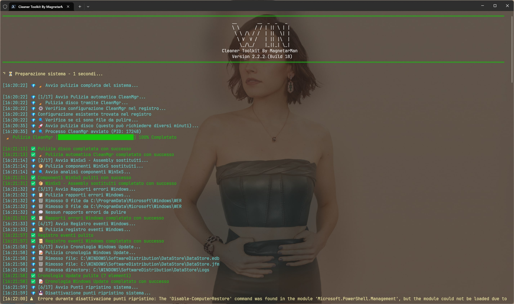
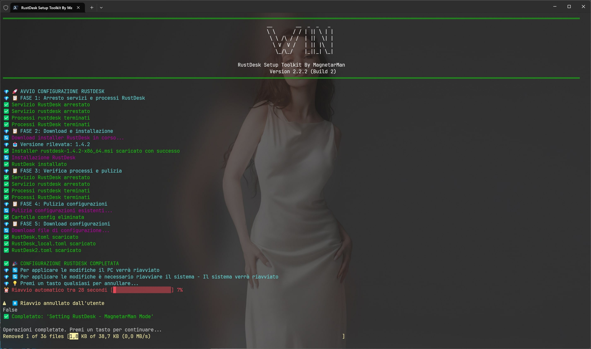
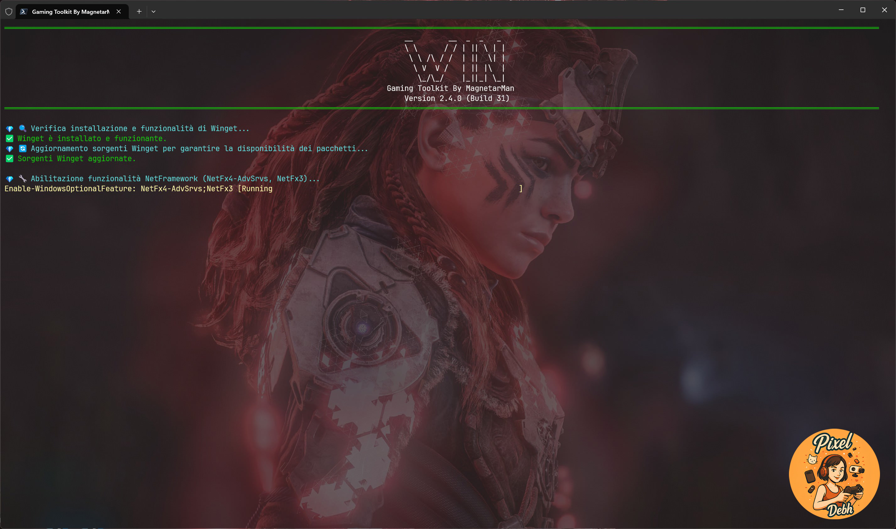
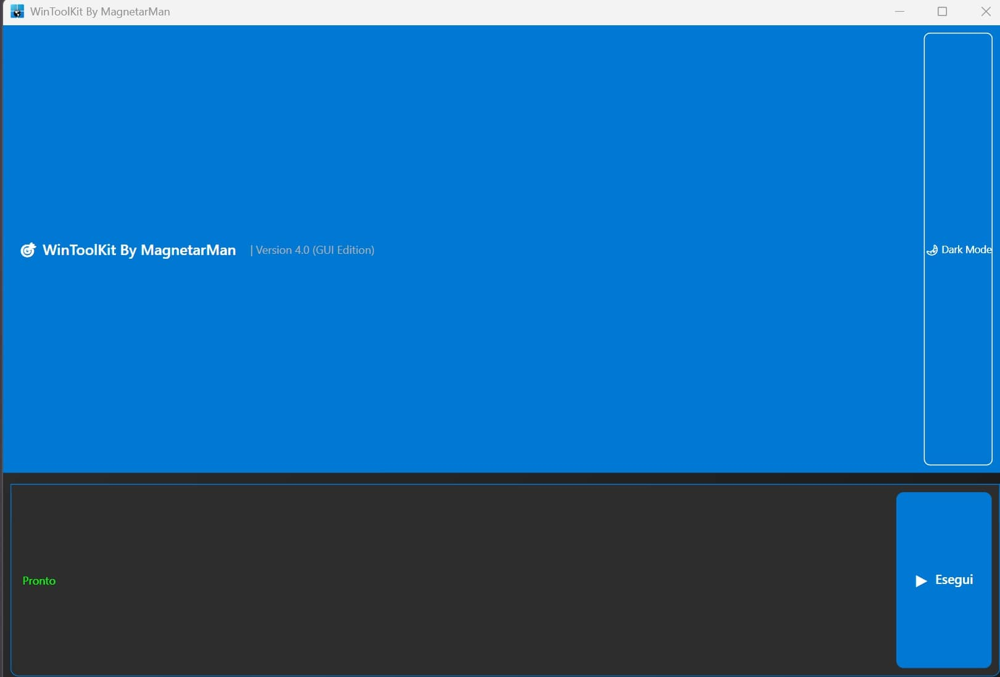
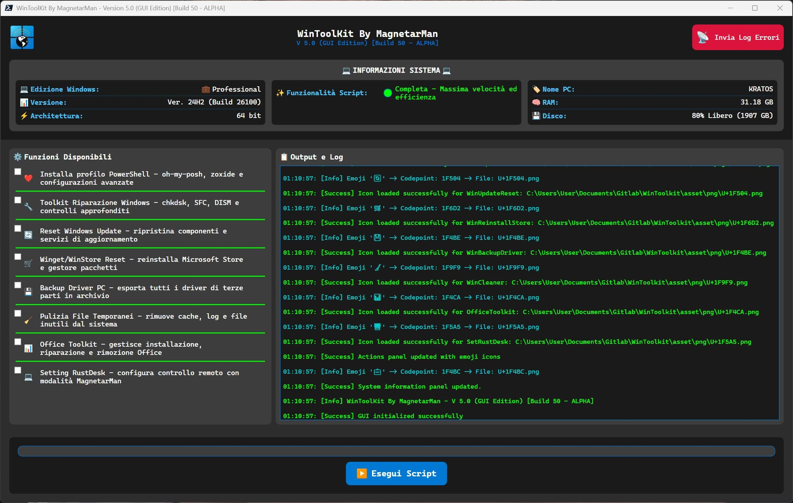

<p align="center">
	
</p>
<br>
<p align="center">
	<em><code>🛠️ WinToolkit: La Soluzione Definitiva per SOPRAVVIVERE A WINDOWS.</code></em>
    <br>
    <br>
    WinToolkit è una suite di script PowerShell potente e compatta, progettata per offrire a professionisti IT, amministratori di sistema e utenti esperti un controllo granulare sulla manutenzione e sulla risoluzione dei problemi di Windows e della Suite Office. Questo toolkit intuitivo aggrega gli strumenti di riparazione di sistema più efficaci in un'unica interfaccia, automatizzando i processi complessi per ottimizzare le prestazioni e ripristinare la stabilità del sistema con pochi passaggi automatizzati.
</p>
<br>
<p align="center">


</p>
<p align="center">
  <br>
     <br>
    <b>🪟 Versioni di Windows Supportate: 🪟</b><br><br>
    <b>🔴 Windows 7 - Non Supportato.</b><br>
    <b>🔴 Windows 8 - Non Supportato.</b><br>
    <b>🟠 Windows 8.1 - Supporto Parziale.</b><br>
    <b>🟠 Windows 10 (< 1809) - Supporto Parziale.</b><br>
    <b>🟢 Windows 10 (> 1809) - Supporto Completo.</b><br>
    <b>🟡 Windows 11 (< 21H2) - Supporto Completo con eccezioni.</b><br>
    <b>🟢 Windows 11 (> 22H2) - Supporto Completo.</b><br>
</p>
</br>

## 👨‍💻 Status Commit

|                                                                               Ramo Release                                                                                |                                                                                Ramo Dev                                                                                 |
| :-----------------------------------------------------------------------------------------------------------------------------------------------------------------------: | :---------------------------------------------------------------------------------------------------------------------------------------------------------------------: |
| <p align="center"></p> | <p align="center"></p> |

## 📸 ScreenShot

> [!Note]
> Gli screenshot sottostanti dei vari strumenti integrati sono forniti a scopo puramente dimostrativo. Avviando lo script sul tuo PC, l'aspetto e le configurazioni dei tool si adatteranno automaticamente alle impostazioni della tua PowerShell. WinToolkit non modifica o sovrascrive alcuna configurazione esistente.

<div align="center">

|                                                                            |                                                                           |
| :------------------------------------------------------------------------: | :-----------------------------------------------------------------------: |
|                |                       |
|    |       |
|        |         |
|    |       |
|  |  |

</div>

## 👾 Features

- **Interfaccia Intuitiva**: Nonostante la sua potenza, il toolkit presenta un menu interattivo e facile da utilizzare, che guida l'utente nella scelta dello strumento più adatto per il problema.
- **Cartella di lavoro unica**: Le operazioni del programma sono centralizzate in un'unica cartella di lavoro, situata in `%localappdata%\WinToolkit`. È importante mantenere questa directory per garantire la corretta visualizzazione e il funzionamento dell'icona di collegamento sul desktop. Lo strumento è concepito per operare in modo completamente autonomo e online, eliminando la necessità di creare cartelle temporanee aggiuntive per la sua esecuzione.
- **Log Dettagliati**: Tutte le operazioni sono registrate in un file di log salvato nel percorso `%localappdata%\WinToolkit\logs`, fornendo un riassunto chiaro delle azioni eseguite, degli errori riscontrati e dei risultati finali.

---

### ℹ️ Descrizione Funzioni Toolkit

- **Windows Repair Toolkit**: Avvia una sequenza automatizzata di comandi standard di Windows come sfc, chkdsk e DISM per individuare e correggere la corruzione dei file di sistema e i problemi del disco.
- **Windows Update Reset**: Risolve in modo efficiente i problemi comuni di Windows Update resettando i componenti chiave e ripristinando le impostazioni dei servizi.
- **Office Toolkit**: Strumento di gestione completo per Microsoft Office che semplifica l'installazione, la riparazione e la rimozione dei prodotti. È possibile installare una versione "Basic" di Microsoft Office in modo semi-automatico, riparare le installazioni esistenti con due diverse modalità (Riparazione Rapida offline e Riparazione Completa online), oppure rimuovere completamente il software dal sistema utilizzando l'efficace tool ufficiale Microsoft Support and Recovery Assistant (SaRA).
- **Windows Store Repair**: Esegue una reinstallazione di componenti critici come Microsoft Store, Winget, e UniGet UI (Utile per aggiornare e gestire le app in modo grafico utilizzando Winget).
- **Win Backup Driver**: Un versatile script PowerShell progettato per semplificare il processo di backup dei driver. Questo strumento automatizza l'esportazione di tutti i driver di terze parti installati, utilizzando il comando DISM per garantire un'operazione completa e affidabile.
- **Cleaner Toolkit**: Il suo scopo è liberare spazio su disco e ottimizzare le prestazioni eseguendo una pulizia profonda attraverso una serie di azioni automatizzate.
- **Video Driver Install**: Il suo scopo è semplificare l'installazione, l'aggiornamento, la reinstallazione e la configurazione ottimale dei driver video (GPU) per sistemi NVIDIA e AMD, gestendo anche la pulizia precedente e bloccando gli aggiornamenti automatici dei driver da Windows Update, spesso fonte di instabilità.

> [!WARNING]
>
> **Video Driver Install**
>
> Come funziona ?
>
> Esegui lo script: Al riavvio del tuo PC, il sistema entrerà automaticamente in Modalità Provvisoria senza che tu debba fare nulla.
>
> Una volta terminate le tue operazioni (Pulizia dei Driver Obsoleti tramite DDU), troverai un file chiamato "Switch To Normal Mode.bat" sul tuo Desktop. Per tornare alla modalità di avvio standard di Windows, fai doppio click su questo file e poi riavvia normalmente il computer.

- **Gaming Toolkit**: Progettato per ottimizzare rapidamente il tuo PC Windows per le massime prestazioni di gioco. Si occupa di installare tutti i componenti essenziali (come DirectX, .NET e Visual C++ redistributables), installa i client di gioco più comuni (Steam, Epic, GOG, ecc.), attiva il profilo energetico 'Performance Massime' e disattiva le interruzioni con la modalità "Non disturbare". Essenzialmente, prepara il tuo sistema per giocare senza distrazioni e con la massima potenza.

> [!WARNING]
>
> **Gaming Toolkit**
>
> A causa dell'installazione non completa di Winget nei sistemi precedenti a Windows 11 23H2 lo script consiglierà di effettuare la funzione riparazione Winget e poi procederà in modo da avere funzionalità Massime. Per Windows 11 superiori a 23H2 lo script verrà eseguito normalmente.

- **BitLocker Toolkit**: Avvia un processo automatizzato per disattivare la crittografia BitLocker sul drive di sistema (C:). Lo strumento verifica lo stato attuale e, se attivo, esegue il comando per avviare la decrittografia del volume in modo controllato. Infine aggiunge al registro di sistema una voce per cercare di contrastare future e possibili ri-attivazione occulte da parte di Microsoft.

- **Set Rust Desk**: Semplifica il processo di installazione e configurazione di RustDesk sui sistemi Windows per il supporto tecnico.

> [!IMPORTANT]
>
> **Set Rust Desk**
>
> **Lo script di setting di Rust Desk è destinato esclusivamente alle macchine che richiedono assistenza tecnica futura da parte mia. Verrà installa una versione personalizzata di RustDesk preconfigurata per l'assistenza tecnica remota.**

---

### 🤔 Perché WinToolkit?

Sia che tu stia gestendo un parco macchine aziendale o che tu voglia semplicemente mantenere il tuo PC personale in perfette condizioni, WinToolkit ti permette di:

- **Risparmiare Tempo**: Automatizza ore di lavoro manuale di diagnostica e riparazione.
- **Prevenire Malfunzionamenti**: Esegui manutenzioni preventive per evitare problemi futuri.
- **Agire da Esperto**: Sfrutta la potenza degli strumenti di sistema ufficiali Microsoft con un'interfaccia semplice e sicura. Nessun Software Terzo, nessuno script aggressivo o non perfettamente documentato ed utilizzato dai supporti ufficiali.

---

## 💖 Supporta il Progetto WinToolkit!

Se WinToolkit ti è stato utile, considera di supportare attivamente il mio lavoro. La tua donazione non è solo un ringraziamento, ma un investimento diretto nel futuro e nello sviluppo di questo strumento.

### Perché Donare

🚀 Sviluppo Continuo: Le donazioni mi permettono di dedicare più tempo e risorse per mantenere la versione attuale aggiornata e compatibile, e per implementare nuove, potenti funzionalità.

🏆 Entra nella Hall of Fame: Ogni donatore verrà incluso in una nuova sezione dedicata all'interno della lista dei contributori come ringraziamento per il tuo prezioso supporto.

✨ Accesso Esclusivo alla Versione 5 GUI Edition (Coming Soon): Per coprire i costi e il tempo di sviluppo che impiego, la futura e attesissima Versione 5.0 con Interfaccia Grafica (GUI) sarà facilmente offerta in anteprima a chi avrà supportato il progetto con una donazione libera. La versione da terminale (attualmente disponibile) rimarrà comunque completamente gratuita per tutti.

### 👛 Come Donare Liberamente

Per effettuare una donazione, clicca sul bottone PayPal qui sotto. È fondamentale che tu aggiunga un riferimento a "WinToolkit" nel messaggio della donazione per potermi permettere di catalogare correttamente il tuo contributo e garantirti l'inserimento nella Hall of Fame dei Contributori.

[](https://paypal.me/MagnetarManit/10)

### 🔰 Oppure, Contribuisci Attivamente!

La collaborazione è fondamentale! Se non puoi donare, puoi comunque aiutarmi a migliorare WinToolkit attraverso queste azioni:

💬 **[Partecipa alle Discussioni](https://t.me/GlitchTalkGroup)**: Condividi le tue idee, fornisci feedback o fai domande.

🐛 **[Segnala Problemi](https://github.com/Magnetarman/WinToolkit/issues)**: Segnala i bug che hai trovato o richiedi nuove funzionalità per il progetto WinToolkit.

💡 **[Invia Pull Request](https://github.com/Magnetarman/WinToolkit/issues)**: Revisiona le Pull Request (PR) aperte e invia le tue modifiche al codice.

Grazie di cuore per il tuo supporto!

## 🪟 v 5.0 - Gui Mode (Coming Soon)

> [!CAUTION]
> L'immagine mostrata di seguito è un'anteprima della versione grafica (GUI) di WinToolkit, attualmente in uno stadio Alpha di pre-produzione.
>
> Si fa notare che la veste grafica definitiva potrebbe subire variazioni, anche significative. L'inclusione di questa screenshot in questa fase risponde alle numerose richieste degli utenti che hanno espresso un forte interesse per l'implementazione futura di un'interfaccia grafica.

<div align="center">
 
</div>

|                                 Before                                  |                                 After                                 |
| :---------------------------------------------------------------------: | :-------------------------------------------------------------------: |
|  |  |

---

## 📁 Struttura Cartelle

```sh
└── WinToolkit/
    └── asset (Cartella Asset vari necessari alle funzioni del ToolKit)
        └── png (Cartella icone GUI)
    └── img (Cartella immagini contenute nel Readme.md)
    ├── CHANGELOG.md (Lista delle modifiche apportate nelle varie versioni del progetto.)
    ├── CONTRIBUTORS.md (Lista Contributori del progetto)
    ├── LICENSE
    ├── README.md
    ├── start.ps1 (script di start. installa il necessario per far funzionare WinToolkit al 100%)
    └── WinToolkit.ps1
```

---

## 🚀 Avviare il Toolkit

> [!IMPORTANT]
> Prima di avviare il toolkit, assicurati che il tuo ambiente di Runtime soddisfi i seguenti requisiti:
>
> - **Richiesta Connessione ad internet durante l'esecuzione del Tool**.
> - **Spazio su disco Consigliato**: 50GB Liberi.

### 💾 Perche almeno 50 GB liberi ?

È fondamentale capire che questo spazio non serve per lo strumento (che è online e pesa pochissimi kilobyte), né per scaricare dati. I 50 GB servono esclusivamente a Windows per garantire la sua stabilità e il corretto funzionamento durante le operazioni di riparazione.

#### Perché è Necessario Questo Ampio Margine?

Quando il sistema operativo lavora su componenti critici, ha bisogno di spazio vitale per gestire diversi processi in background:

- File Temporanei e Backup Interni: Windows crea e gestisce file temporanei, copie di backup interne e cache durante la manutenzione.
- Gestione del File di Paging (Memoria Virtuale): Lo spazio è cruciale per il file di paging, che Windows utilizza come "sostituto" temporaneo della RAM quando la memoria fisica si esaurisce. Se questo spazio è insufficiente, si possono verificare gravi errori di sistema.
- Prevenzione di Malfunzionamenti: Operare con poco spazio libero (tipicamente meno del 10–15% dello spazio totale) è una causa comune di rallentamenti e malfunzionamenti generici in Windows. Avere un margine così ampio previene questi problemi e assicura che il sistema non diventi instabile.

In sintesi, i 50 GB sono una misura cautelativa per fornire a Windows l'ambiente di lavoro ideale e completare le operazioni senza interruzioni o errori dovuti alla gestione inefficiente dello spazio su disco.

### ⚙️ Avvio **Consigliato**

Installa L'eseguibile del Toolkit sul Desktop seguendo queste istruzioni:

1. Premi il Tasto Windows sulla tastiera.
2. Digita `Powershell` nel campo della ricerca.
3. Click col tasto destro del mouse sulla voce Powershell.
4. Click sulla voce `Esegui come Amministratore` dal menù a tendina.
5. inserisci il comando sottostante per avviare lo script di start nella finestra Powershell:

```powershell
 irm https://magnetarman.com/winstart | iex
```

6. Al riavvio del tuo PC troverai la scorciatoia `Win Toolkit` sul desktop da cui avviare comodamente lo script in modalità amministratore con un semplice doppio click sull'icona.

### ⚙️ Avvio Classico

> [!CAUTION]
> Per gli utenti esperti che desiderano avviare il toolkit direttamente oppure utilizzano il ToolKit su versioni parzialmente supportate come Windows 8.1 & Windows 10 < 1809, è consigliabile installare il profilo PowerShell e utilizzare PowerShell 7 o versioni successive. Questa versione moderna è necessaria per garantire la massima compatibilità, eseguire correttamente le operazioni del tool e prevenire errori di runtime o l'errata applicazione delle modifiche.

1. Premi il Tasto Windows sulla tastiera.
2. Digita `Powershell` nel campo della ricerca.
3. Click col tasto destro del mouse sulla voce Powershell.
4. Click sulla voce `Esegui come Amministratore` dal menù a tendina.
5. inserisci il comando sottostante per avviare lo script di start nella finestra Powershell:

```powershell
 irm https://magnetarman.com/WinToolkit | iex
```

### ⚙️ Avvio Toolkit [Ramo `Dev`]

> [!WARNING]
> Avviare il Toolkit dal ramo `Dev` è **rischioso**. **Potrebbe causare danni al tuo sistema.** Sono presenti funzionalità in corso di sviluppo e/o in fase di test. Per utenti non esperti si consiglia **fortemente** di eseguire il ramo stabile del toolkit `main`.

1. Premi il Tasto Windows sulla tastiera.
2. Digita Powershell nel campo della ricerca.
3. Click col tasto destro del mouse sulla voce Powershell.
4. Click sulla voce `Esegui come Amministratore` dal menù a tendina.
5. Inserisci il comando sottostante per avviare lo script di start nella finestra Powershell:

```powershell
irm https://magnetarman.com/WinToolkit-Dev | iex
```

---

## 📌 Changelog Progetto

Per un resoconto dettagliato di ogni modifica, correzione e funzionalità introdotta, consulta il changelog completo [QUI](/CHANGELOG.md). La lista delle funzioni relative alla versione in sviluppo nel ramo `Dev` sono contenute ed aggiornate [QUI](/TODO.md)

---

## 🌟 Lista dei Contributori

Guarda la lista delle fantastiche persone che hanno deciso di investire le loro energie per migliorare questo progetto [QUI](/CONTRIBUTORS.md).

---

## 💀 Dove tutto è iniziato (V 1.0)

<div align="center">

|                                                              |                                                                                   |
| :----------------------------------------------------------: | :-------------------------------------------------------------------------------: |
|  |  |

## </div>

## 🎗 Licenza

Creato con ❤️ da [Magnetarman](https://magnetarman.com/). Licenza MIT. Se trovi questo progetto utile, considera di lasciare una ⭐

---

## 🙌 Personalizzazioni

Segui le istruzioni che il tool ti comunicherà a video per personalizzare le funzioni.
