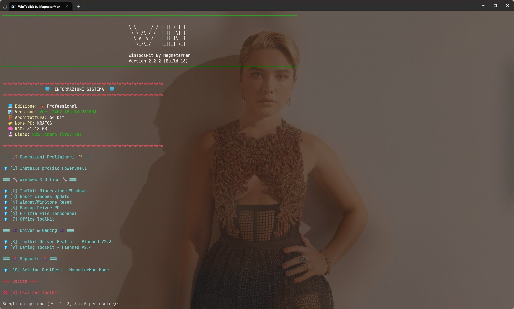
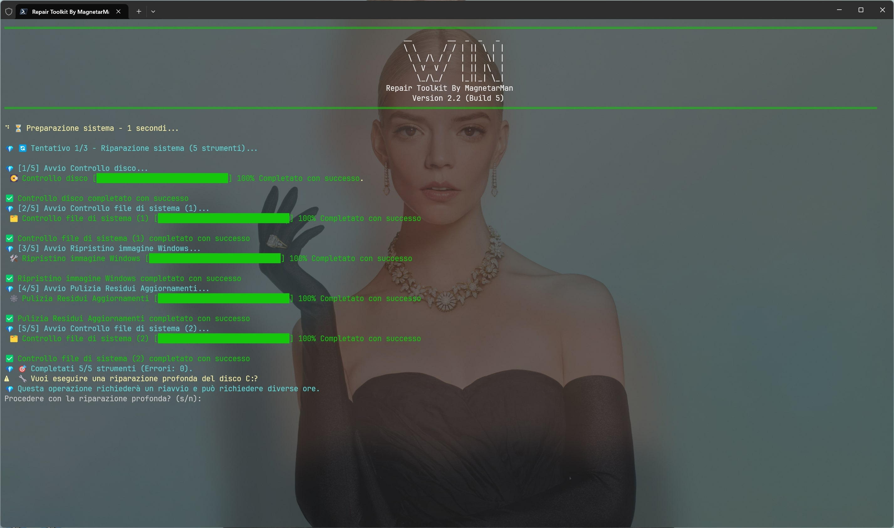
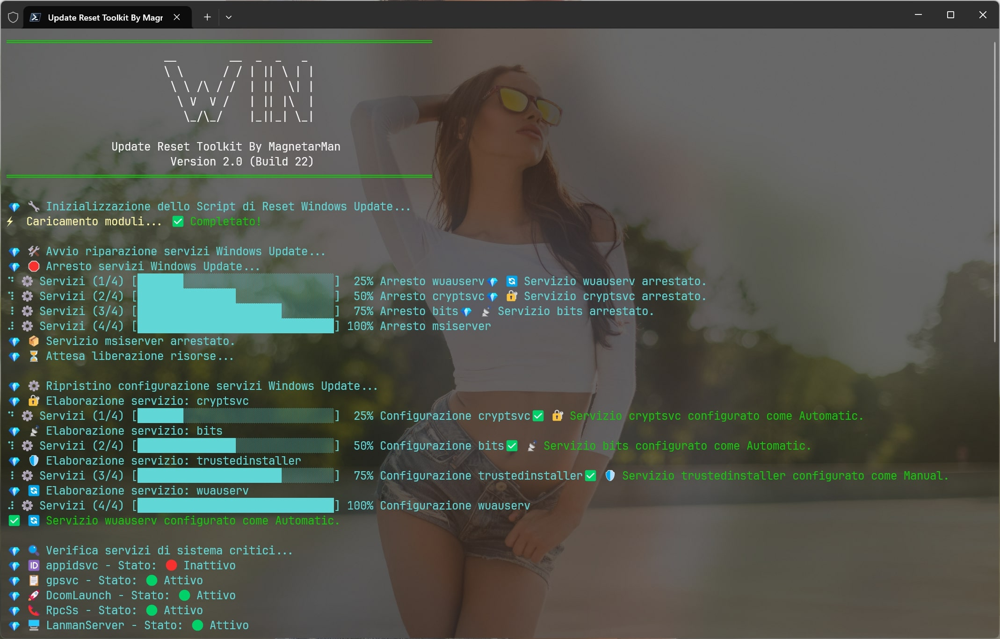
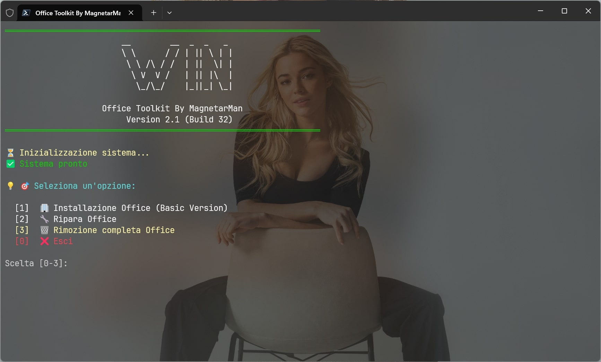

<p align="center">
	
</p>
<br>
<p align="center">
	<em><code>🛠️ WinToolkit: La Soluzione Definitiva per SOPRAVVIVERE A WINDOWS.</code></em>
    <br>
    <br>
    <code>WinToolkit è una suite di script PowerShell potente e compatta, progettata per offrire a professionisti IT, amministratori di sistema e utenti esperti un controllo granulare sulla manutenzione e sulla risoluzione dei problemi di Windows e della Suite Office. Questo toolkit intuitivo aggrega gli strumenti di riparazione di sistema più efficaci in un'unica interfaccia, automatizzando i processi complessi per ottimizzare le prestazioni e ripristinare la stabilità del sistema con pochi passaggi automatizzati.</code>
</p>
<br>

<p align="center">


</p>
</br>

## 👨‍💻 Status Commit

|                                                                               Ramo Release                                                                                |                                                                                Ramo Dev                                                                                 |
| :-----------------------------------------------------------------------------------------------------------------------------------------------------------------------: | :---------------------------------------------------------------------------------------------------------------------------------------------------------------------: |
| <p align="center"></p> | <p align="center"></p> |

## 📸 ScreenShot

> [!Note]
> Gli screenshot sottostanti dei vari strumenti integrati sono forniti a scopo puramente dimostrativo. Avviando lo script sul tuo PC, l'aspetto e le configurazioni dei tool si adatteranno automaticamente alle impostazioni della tua PowerShell. WinToolkit non modifica o sovrascrive alcuna configurazione esistente.

<div align="center">

|                                                                          |                                                                      |
| :----------------------------------------------------------------------: | :------------------------------------------------------------------: |
|              |                  |
|  |  |
|  |                                                                      |

</div>

---

## 👾 Features

> [!Note]
> Ramo `main` <br> La versione 2.1 del Toolkit è in fase **RELEASE**.
>
> Ramo `Dev` <br> **Attenzione:** Avviare il Toolkit dal ramo `Dev` è **rischioso**. **Potrebbe causare danni al tuo sistema.**

- **Interfaccia Intuitiva**: Nonostante la sua potenza, il toolkit presenta un menu interattivo e facile da utilizzare, che guida l'utente nella scelta dello strumento più adatto per il problema.
- **Riparazione del Sistema Completa**: Avvia una sequenza automatizzata di comandi standard di Windows come sfc, chkdsk e DISM per individuare e correggere la corruzione dei file di sistema e i problemi del disco. Il tool esegue più tentativi e genera un log dettagliato garantendo una tracciabilità completa delle operazioni.
- **Ripristino di Windows Update**: Risolve in modo efficiente i problemi comuni di Windows Update resettando i componenti chiave e ripristinando le impostazioni dei servizi. Questo script blocca e riavvia i servizi di aggiornamento, rinomina e cancella le directory di cache e ripara il registro di sistema, garantendo che il tuo sistema possa scaricare e installare gli aggiornamenti essenziali senza intoppi.
- **Toolkit Office**: Strumento di gestione completo per Microsoft Office che semplifica l'installazione, la riparazione e la rimozione dei prodotti. Con la sua interfaccia intuitiva, ti guida attraverso ogni operazione, rendendo la gestione di Office accessibile a tutti. È possibile installare una versione "Basic" di Microsoft Office in modo semi-automatico, riparare le installazioni esistenti con due diverse modalità (Riparazione Rapida offline e Riparazione Completa online), oppure rimuovere completamente il software dal sistema utilizzando l'efficace tool ufficiale Microsoft Support and Recovery Assistant (SaRA). Questo garantisce la risoluzione dei problemi più comuni, dai malfunzionamenti minori ai conflitti più complessi che richiedono una pulizia completa, offrendo un'esperienza professionale e affidabile.
- **Log Dettagliati**: Tutte le operazioni sono registrate in un file di log salvato nel percorso `%localappdata%\WinToolkit\logs` (Inserisci il percorso senza apici dopo aver digitato `esegui` nel menu start di windows per accedere alla cartella dei log), fornendo un riassunto chiaro e professionale delle azioni eseguite, degli errori riscontrati e dei risultati finali.

### Perché WinToolkit?

Sia che tu stia gestendo un parco macchine aziendale o che tu voglia semplicemente mantenere il tuo PC personale in perfette condizioni, WinToolkit ti permette di:

- **Risparmiare Tempo**: Automatizza ore di lavoro manuale di diagnostica e riparazione.
- **Prevenire Malfunzionamenti**: Esegui manutenzioni preventive per evitare problemi futuri.
- **Agire da Esperto**: Sfrutta la potenza degli strumenti di sistema ufficiali Microsoft con un'interfaccia semplice e sicura. Nessun Software Terzo, nessuno script aggressivo o non perfettamente documentato ed utilizzato dai supporti ufficiali.

---

## 📁 Struttura Cartelle

```sh
└── WinToolkit/
    └── img
        ├── RepairToolkit.jpg
        ├── Run.jpg
        ├── Starter.jpg
        ├── Office-Toolkit.jpg
        └── WinToolkit-icon.png
    ├── LICENSE
    ├── README.md
    ├── start.ps1
    └── WinToolkit.ps1
```

### 📂 Index Progetto

<details open>
	<summary><b><code>WinToolKit</code></b></summary>
		<blockquote>
			<table>
				<tr>
					<td><b><a href='https://github.com/Magnetarman/WinToolkit/blob/main/start.ps1'>start.ps1</a></b></td>
					<td><code>❯ Script di Start. Installa tutto il necessario automaticamente per far funzionare al meglio il ToolKit, Crea una scorciatoia sul Dekstop per avviare il Toolkit ed infine riavvia il PC per apportare le modifiche.</code></td>
				<tr>
					<td><b><a href='https://github.com/Magnetarman/WinToolkit/blob/main/WinToolkit.ps1'>WinToolkit.ps1</a></b></td>
					<td><code>❯ All'interno di questo script sono contenute tutte le funzioni ed il codice del tool.</code></td>
				</tr>
				</tr>
			</table>
		</blockquote>
</details>

---

## 🚀 Getting Started

### ☑️ Prerequisiti

Prima di avviare il tool, assicurati che il tuo ambiente di Runtime soddisfi i seguenti requisiti:

- **Windows Defender** di 24H2 potrebbe rilevare come pericoloso questo script. **E' fortemente consigliata la disattivazione temporanea durante le operazioni**.
- **Richiesta Connessione ad internet durante l'esecuzione del Tool**.
- Richiesto intervento manuale minimo.
- **Spazio su disco necessario**: 50GB Liberi (Windows durante le operazioni di riparazione occuperà temporaneamente dello spazio. L'indicazione di 50GB è sovrastimata ed utile per avere un certo margine di spazio libero ulteriore per il corretto funzionamento del Sistema).

### ⚙️ Installazione per Neofiti **(Consigliata)**

Installa L'eseguibile del Toolkit sul Desktop seguendo queste istruzioni:

1. Premi il Tasto Windows sulla tastiera.
2. Digita `Powershell` nel campo della ricerca.
3. Click col tasto destro del mouse sulla voce Powershell.
4. Click sulla voce `Esegui come Amministratore` dal menù a tendina.
5. inserisci il comando sottostante per avviare lo script di start nella finestra Powershell:

```powershell
 irm https://magnetarman.com/winstart | iex
```

6. Al riavvio del tuo PC troverai la scorciatoia `Win Toolkit V2.1` sul desktop da cui avviare comodamente lo script in modalità amministratore con un semplice doppio click sull'icona.

### ⚙️ Avvio Classico

> [!Tip]
> Per gli utenti esperti che desiderano avviare il toolkit direttamente, è consigliabile installare il profilo PowerShell e utilizzare PowerShell 7 o versioni successive. Questa versione moderna è necessaria per garantire la massima compatibilità, eseguire correttamente le operazioni del tool e prevenire errori di runtime o l'errata applicazione delle modifiche.

Avvia il Toolkit eseguendo le seguenti istruzioni:

1. Clona la repository WinToolkit:

```powershell
 git clone https://github.com/Magnetarman/WinToolkit
```

2. Utilizza il terminale in modalità Amministratore per Navigare fino alla cartella:

```powershell
 cd WinToolkit
```

3. Lancia il Toolkit:

```powershell
 ./WinToolkit.ps1
```

### ⚙️ Avvio Toolkit [Ramo `Dev`]

**Attenzione:** Avviare il Toolkit dal ramo `Dev` è **rischioso**. **Potrebbe causare danni al tuo sistema.** Sono presenti funzionalità in corso di sviluppo e/o in fase di test. Per utenti non esperti si consiglia **fortemente** di eseguire il ramo stabile del toolkit `main`.

1. Premi il Tasto Windows sulla tastiera.
2. Digita Powershell nel campo della ricerca.
3. Click col tasto destro del mouse sulla voce Powershell.
4. Click sulla voce Esegui come Amministratore dal menù a tendina.
5. Inserisci il comando sottostante per avviare lo script di start nella finestra Powershell:

```powershell
irm https://magnetarman.com/WinToolkit-Dev | iex
```

---

## 📌 Project Roadmap

- [x] **`V1.0`**: Release Privata.
- [x] **`V1.1.0`**: Refactor Struttura in forma modulare.
- [x] **`V2.0.0`**: **RELEASE Pubblica**. Refator totale progetto per future implementazioni.
- [x] **`V2.0.0 (Build 68)`**: Funzione **Repair Toolkit** Completa.
- [x] **`V2.0.0 (Build 71)`**: Funzione **Update Reset** Completa.
- [x] **`V2.0.0 (Build 72)`**: Readme Rework, Rework Grafico Script.
- [x] **`V2.0.0 (Build 73)`**: Start Script Potenziato, Fix Tool **Update Reset**.
- [x] **`V2.0.0 (Build 82)`**: Rework Grafico `WinToolkit.ps1`.
- [x] **`V2.0.1 (Build 3)`**: Ottimizzazione Script `WinReinstallStore.ps1`, `WinRepairToolkit.ps1`, Aggiornamento `Readme.md`, Potenziamento `WinToolkit.ps1` con le **Informazioni del Sistema**.
- [x] **`V2.1 (Build 15)`**: Funzione **Office Toolkit** Completa, Aggiornamento `Readme.md`, Potenziamento Funzione **Informazioni del Sistema**.
- [x] **`V2.1 (Build 16)`**: Cambio redirect link script da github a MagnetarMan.com. Aggiornamento script `start.ps1`.
- [ ] **`V2.2`**: Funzione **Windows Repair Plus** Completa.
- [ ] **`V2.3`**: Funzione **Driver & Gaming** Completa.
- [ ] **`V2.4`**: Funzione **Gaming Ready** Completa.
- [ ] **`V2.5`**: Funzione **Auto Debloat** Completa.
- [ ] **`V2.6`**: Funzione **Security Update** Completa.
- [ ] **`V3.0.0`**: Finalizzazione "MagnetarMan Mode".

### 🗺️ Roadmap Versioni Future

#### V2.2 - "Windows Repair Plus"

- [x] Reinstallazione Forzata Microsoft Store & Winget.
  - [x] Installazione di Uniget.
- [ ] Reset Rust Desk.
- [ ] Backup Driver Installati => Compressione in file .zip => Posizionamento archivio sul desktop.

#### V2.3 - "Driver & Gaming"

- [ ] Scelta Driver Video (AMD/NVIDIA).
- [ ] Installazione Driver Ottimizzato (Nvidia).
- [ ] Download ultima versione di DDU.
  - [ ] Estrazione.
  - [ ] Posizionamento nella cartella Downloads.
  - [ ] Riavvio modalità provvisoria.

#### V2.4 - "Gaming Ready"

- [ ] Installazione client di gioco (Amazon, Gog Galaxy, Epic Games, Steam).
- [ ] Installazione Playnite ed applicazione Tema personalizzato.
- [ ] Installazione/Aggiornamento Directx.
- [ ] Installazione/Aggiornamento Microsoft C++ Package.

#### V2.5 - "Auto Debloat"

- [ ] Avvio script Chris con config personalizzata iwr -useb https://christitus.com/win | iex

#### V2.6 - "Security Update"

- [ ] Download di Tron Script ed esecuzione con intervento minimo.

#### V3.0 - "MagnetarMan Mode"

- [ ] Finalizzazione "MagnetarMan Mode"
  - [ ] Avvio Script Chris con configurazione personalizzata
  - [ ] Installazione Programmi
    - [ ] Brave Browser
    - [ ] Google Chrome
    - [ ] Betterbird
    - [ ] Fan Control
    - [ ] PowerToys
    - [ ] Uniget
    - [ ] Crystal Disk info
    - [ ] HwInfo
    - [ ] Rust Desk
    - [ ] Client Giochi (Amazon, Gog Galaxy, Epic Games, Steam)
  - [ ] Installazione .NET Runtime (Dalla 4.8 alla 9.0)
  - [ ] Installazione Microsoft C++ Package
  - [ ] Installazione/Aggiornamento Directx
  - [ ] Playnite (Lancher/Aggregatore)
  - [ ] Revo Unistaller
  - [ ] Tree Size
  - [ ] Glary Utilities
  - [ ] Pulizia Sistema
  - [ ] Applicazione Sfondo "MagnetarMan"
  - [ ] Riavvio PC per completare le modifiche

#### 🕹️ TO DO (Future Implementazioni)

- [ ] Download immagine di Windows 23H2 Microwin
  - [ ] Posizionamento nella cartella download, pronta per essere utilizzata

---

## 🔰 Come Contribuire

- **💬 [Partecipa alle Discussioni](https://t.me/GlitchTalkGroup)**: Condividi le tue idee, fornisci feedback o fai domande.
- **🐛 [Segnala Problemi](https://github.com/Magnetarman/WinToolkit/issues)**: Segnala i bug trovati o richiedi nuove funzionalità per il progetto `WinToolkit`.
- **💡 [ Invia Pull Request](https://github.com/Magnetarman/WinToolkit/issues)**: Revisiona le Pull Request (PR) aperte e invia le tue.

<details closed>
<summary>Linee Guida</summary>

1. **Esegui il Fork della Repository**: Inizia facendo il "fork" della repository del progetto sul tuo account GitHub.
2. **Clona in Locale**: Clona la repository di cui hai fatto il fork sulla tua macchina locale usando un client Git.

```powershell
   git clone https://github.com/Magnetarman/WinToolkit
```

3. **Crea un Nuovo Branch**: Lavora sempre su un nuovo "branch", dandogli un nome descrittivo.

```powershell
git checkout -b new-feature-x
```

4. **Apporta le Tue Modifiche**: Sviluppa e testa le tue modifiche in locale.
5. **Esegui il Commit delle Tue Modifiche**: Fai il "commit" con un messaggio chiaro che descriva i tuoi aggiornamenti.

```powershell
  git commit -m 'Implementata nuova funzionalità x.'
```

6. **Esegui il Push su GitHub**: Fai il "push" delle modifiche sulla tua repository "fork".

```powershell
   git push origin nuova-funzionalita-x
```

7. **Invia una Pull Request**: Crea una "Pull Request" (PR) verso la repository originale del progetto. Descrivi chiaramente le modifiche e le loro motivazioni.
8. **Revisione**: Una volta che la tua PR sarà revisionata e approvata, verrà unita ("merged") nel branch principale. Congratulazioni per il tuo contributo!
</details>

---

## 🎗 Licenza

Creato con ❤️ da [Magnetarman](https://magnetarman.com/). Licenza MIT. Se trovi questo progetto utile, considera di lasciare una ⭐

---

## 🙌 Personalizzazioni

Segui le istruzioni che il tool ti comunicherà a video per personalizzare le funzioni.
