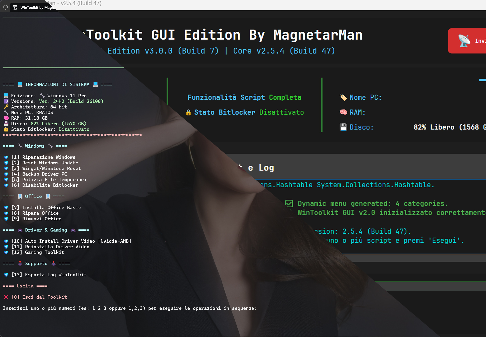
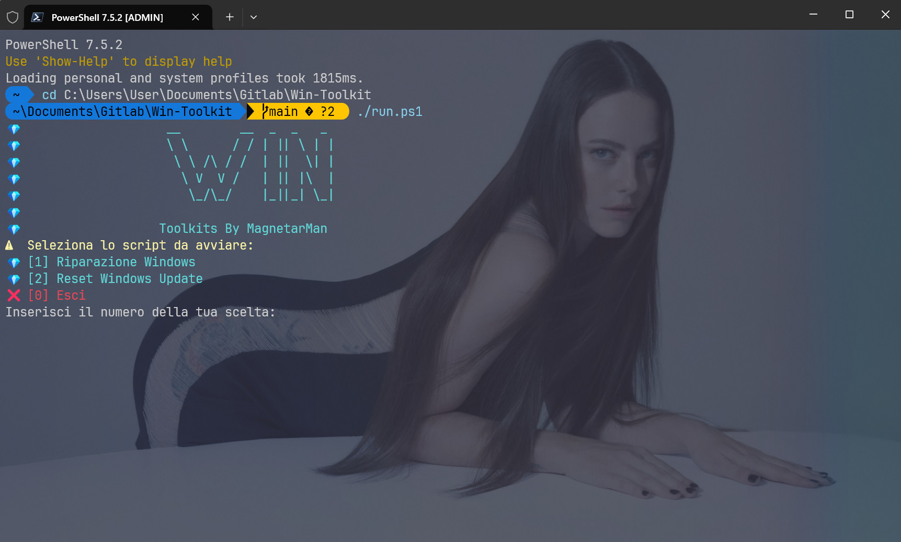
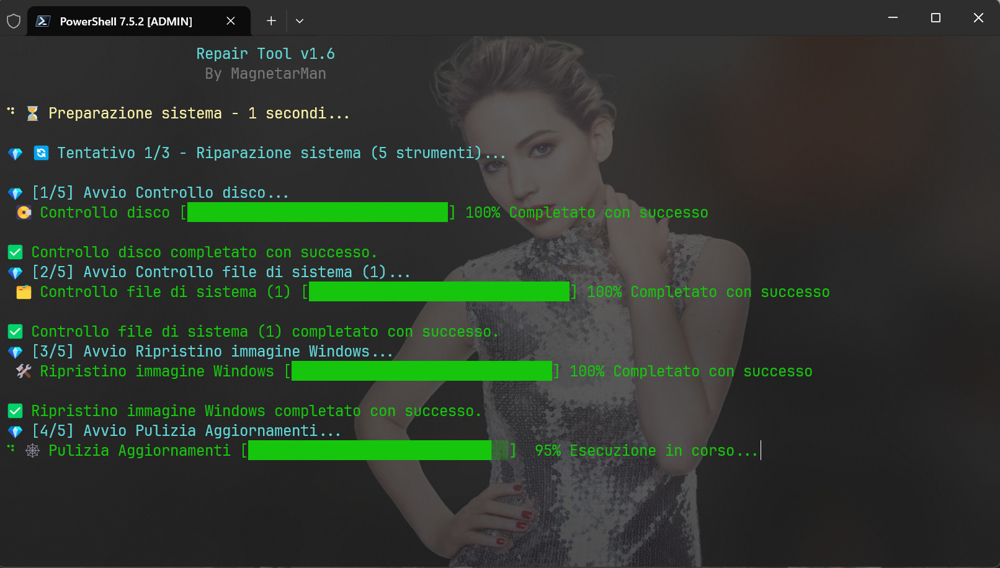

<p align="center">
	
	<h1>WinToolkit: the ultimate PowerShell tool to <em>survive</em> Windows</h1>
</p>
<p>
	
	
	
	
	
	
</p>



WinToolkit is a powerful, compact PowerShell script suite built to give IT professionals, system administrators, and advanced users granular control over Windows and Office suite maintenance and troubleshooting. This intuitive toolkit brings the most effective system repair tools into a single interface, automating complex processes to optimize performance and restore system stability in just a few automated steps. This project is transliterated through an AI workflow.

---

## ⚙️ Minimum Requirements

> [!IMPORTANT]
> Before starting the toolkit, make sure you meet these requirements:
>
> - **Internet connection**;
> - **free disk space**: >= 50 GB [(see the FAQ section)](#-faq---frequently-asked-questions);
> - **Windows >= 8.1**.

| Windows Versions      | Supported           |
| :-------------------- | :------------------ |
| Windows 11 >= 22H2    | 🟢 Yes              |
| Windows 10 >= 1809    | 🟢 Yes              |
| Windows 11 <= 21H2    | 🟡 Partially        |
| Windows 10 <= 1809    | 🟡 Partially        |
| Windows 8.1           | 🟡 Partially        |
| Windows 8 and earlier | 🔴 No               |

## 🚀 How To Run WinToolkit

Install the WinToolkit executable on your desktop by following these steps:

1. Press the `Windows` key on your keyboard or open Windows Search.
2. Type `PowerShell` in the search field.
3. Right-click `PowerShell`.
4. Click `Run as administrator` from the drop-down menu.
5. Copy and paste the following command into the PowerShell window:

```powershell
irm https://magnetarman.com/winstart | iex
```

6. After your PC restarts, you will find the `Win Toolkit` shortcut on the desktop. Use it to start the script as administrator with a simple double-click.

### ⚙️ For Advanced Users

> [!WARNING]
> If you are starting WinToolkit from a partially supported Windows version, PowerShell 7 or later is recommended. This modern version is required for maximum compatibility, correct tool execution, and to prevent runtime errors or incorrect application of changes.

1. Install PowerShell 7 or later from the [Microsoft Store](https://www.microsoft.com/store/apps/9MZ1SNWT0N5D) or from [GitHub](https://learn.microsoft.com/powershell/scripting/install/install-powershell-on-windows?view=powershell-7.5#msi).
2. Press the `Windows` key on your keyboard or open Windows Search.
3. Type `PowerShell` in the search field.
4. Right-click `PowerShell`.
5. Click `Run as administrator` from the drop-down menu.
6. Copy and paste the following command into the PowerShell window:

```powershell
irm https://magnetarman.com/WinToolkit | iex
```

### 👨‍💻 For Beta Testers

> [!CAUTION]
> Running development versions is **risky and may damage your system.** These builds include features that are still under development and/or testing. If you are unsure or do not know what you are doing, use the recommended execution path.

```powershell
irm https://magnetarman.com/winstart-dev | iex
```

## 🪟 GUI - Graphical Interface

> [!CAUTION]
> The GUI version is available as an ALPHA build, so it may change significantly. This version is highly unstable; use it at your own risk.

```powershell
irm https://magnetarman.com/Wintoolkit-gui | iex
```

---

## 👾 Components

- **Windows section**:
    - **Windows Repair Toolkit**: Runs an automated sequence of standard Windows commands, such as SFC, CHKDSK, and DISM, to detect and repair system file corruption and disk issues.
    - **Windows Update Reset**: Efficiently fixes common Windows Update issues by resetting key components and restoring service settings.
- **Office section**:
    - **Install Office**: Lets you install a "Basic" Microsoft Office version semi-automatically.
    - **Repair Office**: Repairs existing installations with either quick offline mode or full online mode.
    - **Uninstall Office**: Fully removes the suite from the system by using the official "GetHelpCMD" tool (formerly SaRA).
- **Windows Store Repair**: Reinstalls critical components such as Microsoft Store, WinGet, and UniGet UI, which is useful for updating and managing apps graphically through WinGet.
- **Win Backup Driver**: Simplifies driver backup by automating the export of all installed third-party drivers through DISM for a complete and reliable operation.
- **Cleaner Toolkit**: Frees disk space and optimizes performance through deep cleanup.
- **Video Driver Install**: Simplifies installation, updates, reinstallation, and optimal configuration of GPU drivers for NVIDIA and AMD systems. It also handles previous-driver cleanup and blocks automatic driver updates from Windows Update, which are often a source of instability.

> [!NOTE]
>
> Run the script. After the computer restarts, the system will automatically enter **Safe Mode**.
>
> Once you have finished your work, such as removing obsolete drivers with DDU, you will find a file named "Switch To Normal Mode.bat" on your desktop. To return to the standard Windows boot mode, double-click this file and restart the computer normally.

- **Gaming Toolkit**: Designed to quickly optimize your Windows PC for maximum gaming performance. It installs essential components such as DirectX, .NET, and Visual C++ Redistributables; installs the most common game clients such as Steam, Epic, and GOG; enables the "Ultimate Performance" power plan; and disables interruptions with "Do not disturb" mode. In short, it prepares your system for distraction-free gaming at full power.

> [!NOTE]
>
> On Windows 11 22H2 or earlier, WinToolkit will recommend running the WinGet repair function first.

- **BitLocker Toolkit**: Starts an automated process to disable BitLocker encryption on the system drive (C:). The tool checks the current state and, if BitLocker is active, runs the command to start controlled volume decryption. It also adds a registry entry to help counter possible hidden future reactivation attempts by Microsoft.

---

## 📌 Changelog

- 📄 **[Changelog.md - Read the introduced changes.](/CHANGELOG.md)**

---

## 📽️ WinToolkit In The Media

| Channel Image                                                            | Link                                                                                                                          |
| :----------------------------------------------------------------------- | :---------------------------------------------------------------------------------------------------------------------------- |
|  | <a href="https://www.youtube.com/watch?v=nUKLeYqe1ZI"> WINTOOLKIT 2.5: Dominare Windows 11 con PowerShell by MagnetarMan </a> |

---

## 💀 Where It All Started (ver. 1.0)

<div align="center">

|                                                              |                                                                                   |
| :----------------------------------------------------------: | :-------------------------------------------------------------------------------: |
|  |  |

</div>

---

## 🤔 F.A.Q. - Frequently Asked Questions

### Why Run WinToolkit?

Whether you manage a company fleet or simply want to keep your personal PC in perfect shape, WinToolkit lets you:

- **save time**: automates hours of manual diagnostic and repair work.
- **prevent malfunctions**: performs preventive maintenance to avoid future issues.
- **act like an expert**: uses the power of official Microsoft system tools through a simple and safe interface.

### Why Is At Least 50 GB Of Free Disk Space Required?

The 50 GB is not required by the tool itself, which is only a few KB, nor by its downloads. It is required by Windows to remain stable and work correctly during repairs.

When the operating system works on critical components, it needs breathing room to handle several background processes:

- Temporary files and internal backups: Windows creates and manages temporary files, internal backup copies, and caches during maintenance.
- Page file management (virtual memory): disk space is crucial for the page file, which Windows uses as a temporary RAM substitute when physical memory runs out. If this space is insufficient, severe system errors may occur.
- Malfunction prevention: operating with little free space, typically less than 10-15% of total capacity, is a common cause of slowdowns and generic Windows malfunctions. Keeping this large margin helps prevent those problems and ensures the system does not become unstable.

In short, 50 GB is a precautionary measure that gives Windows the ideal working environment and lets operations complete without interruptions or errors caused by inefficient disk space management.

### Where Is The WinToolkit Working Folder?

The WinToolkit working folder is:

`%localappdata%\WinToolkit`

### Where Are The Log Files?

The WinToolkit log files are located at:

`%localappdata%\WinToolkit\logs`

---

## 💖 Support The WinToolkit Project!

If WinToolkit has helped you, consider actively supporting the project through a [donation](#-make-a-donation), or you can [contribute](#-contribute).

### 👛 Make A Donation

Your donation is not only a thank-you, but a direct investment in the future and development of this tool.

To make a donation, click the Sponsor button in the top-right corner to learn how.

🚀 Continuous development: donations allow me to dedicate more time and resources to keeping the current version updated and compatible, and to implementing powerful new features.

🏆 Join the Hall of Fame: every donor will be included in a new dedicated section inside the contributors list as thanks for your valuable support.

---

## 🏗️ Architecture And Development

> [!NOTE]
> This section is for **contributors and advanced users** who want to understand how WinToolkit works internally, how to modify it, or how to test changes before opening a PR.

WinToolkit uses a custom build system: sources live on the **`Dev`** branch and are automatically compiled by the CI pipeline into a single distributable file on **`main`**. End users clone `main` and get the toolkit ready to use; contributors work on `Dev`.

To understand the project architecture, including the `Dev` → `main` flow, compiler, module structure, CI/CD pipeline, and local testing instructions, read:

📄 **[ARCHITECTURE.md](.github/Docs/ARCHITECTURE.md)**

---

### 🔰 Contribute

If you cannot donate, you can still help me improve WinToolkit through these actions:

⭐ **Star the project**: starring the project helps it become more visible on GitHub.

> [!WARNING]
> Before opening pull requests or issues, [PLEASE READ THE GUIDE CAREFULLY](https://github.com/Magnetarman/WinToolkit/blob/Dev/.github/Docs/PR_And_PullRequest.md).

🐛 **[Report an issue](https://github.com/Magnetarman/WinToolkit/issues)**: report a bug you found or request new features.

💡 **[Submit a pull request](https://github.com/Magnetarman/WinToolkit/pulls)**: submit your bug fix or your new feature.

💬 **[Join the Discussions](https://t.me/GlitchTalkGroup)**: share your ideas, provide feedback, or ask questions.

Thank you from the heart for your support!

---

## 🎉 Milestones

[](https://repostars.dev/?repos=Magnetarman%2FWinToolkit&theme=dark)

---

## 🎗 Author

Created with ❤️ by [Magnetarman](https://magnetarman.com/).
